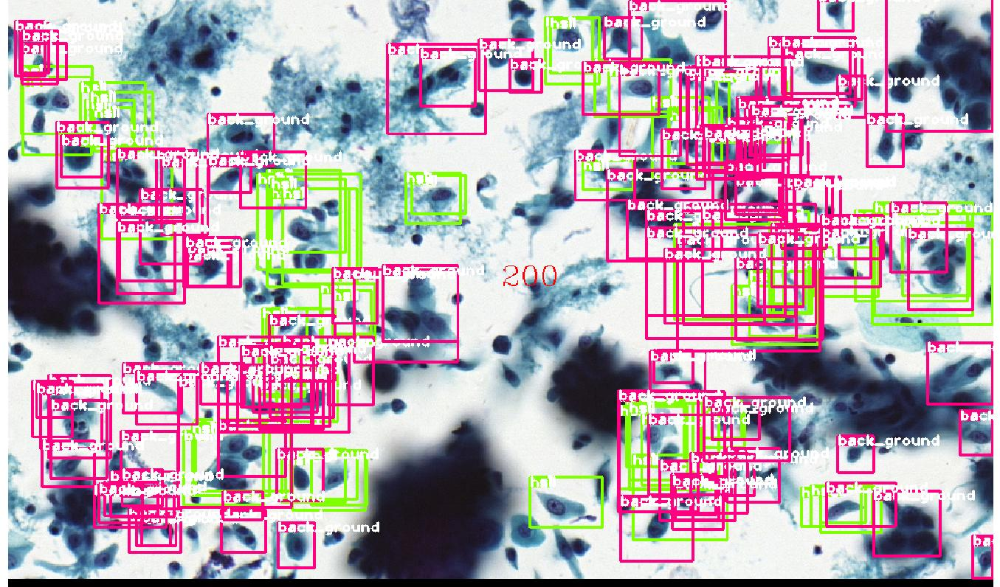
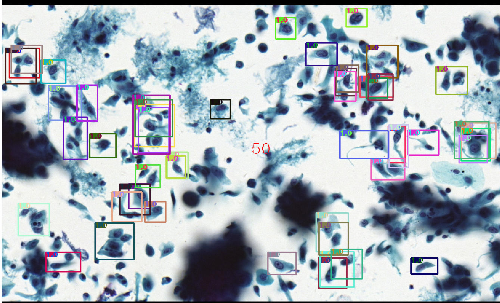
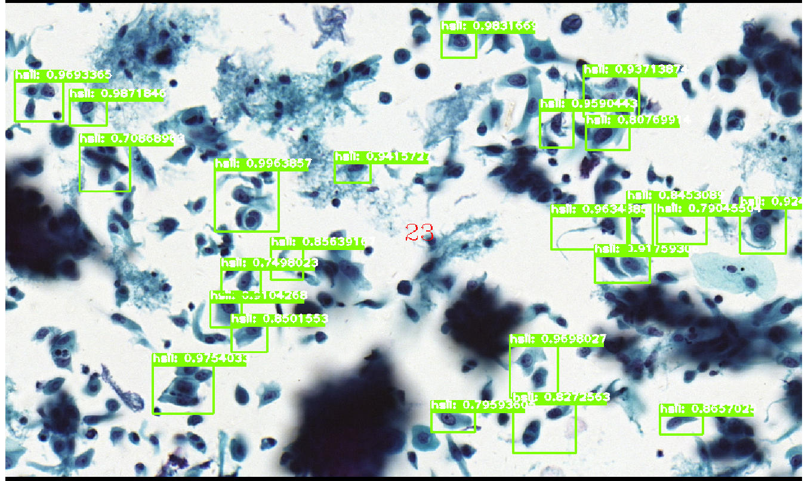

## Feature Pyramid Network
This tensorflow implementation code is based on [Feature Pyramid Networks for Object Detection](https://arxiv.org/abs/1612.03144). **Some code copy from https://github.com/matterport/Mask_RCNN,  some learn from https://github.com/yangxue0827/FPN_Tensorflow**.  

<font color=skyblue size=10>FEATURES:</font>

* Training >=2 image in a GPU
* Training uses Multi-gpu for data parallelism and no significant decrease in performance
* Add ResNet-v2 pretrained model
* The code has been tested and compared to [this implementation](https://github.com/matterport/Mask_RCNN), it has better performance
* Great debug tools and visualization to see result of intermediate process in the tensorboard
* Using tf.Dataset and tf.estimator which has better computational efficiency and more concise code
### Environment
* tensorflow-1.8
* CUDA-9.0
* cuDNN-7.0  
The above environment has been tested.
### Making dataset 
for computational efficiency and coding convenient,we first convert the data into tfrecord format.
We only support the transformation of **COCO** style data. If your data is the style of **VOC**, you must convert the VOC style to COCO style. **One more thing you must notice is that you need to manually add the dictionary of category name and label in your data to /libs/label_dict.py**. Then:

```shell
cd $FPN_Faster_RCNN/data/
python convert_data_to_tfrecord.py --DATA_dir=/cocodataset/ --annotation_dir=annotations/train.json --image_dir=images/train --save_dir=/tfrecord/ --dataset_name=coco --dataset_class=train
```
**Generate**:   
> save_dir
> > dataset_name
> > >train.tfreocrd  
> > >test.tfrecord  
> > >val.tfrecord

### Configuration and Training
this implementation has anthor feature is converted to change any params for users. I collect all params in config.py including: training params, network frame, and sample selection etc. So please change all params need to change for your training, such as: dataset dir, num_class, dataset_name, learning rate. To distinguish resnet50_v2 from resnet_v1, we named it as **resnet_model**. You can download the pre-trained model in [there](https://github.com/tensorflow/models/tree/master/official/resnet).

If you want train with multi-gpu, you just only change the **GPU_GROUPS** in config.py. Then:
```shell
cd tools/
python train.py
```
### Debug and visualization
In the list, each file has a *Debug* signal to decide whether the corresponding summary are made in the tensorboard.  

| file | function |  
|:---:|:---:|
|tools/train.py|Whether draw the rpn proposal of region which is the first 50 in the tensorboard and the final detection results.|
|libs/build_fast_rcnn.py| Whether print out the scores and categories of proposals in fast_rcnn; summary the image of ground-true object and training proposals|

**Of course, you can imitate our code to print out or visualate everything for debug.**


**Display images recorded in tensorboard:**  
ground true objects: 

proposals for training head: 

the first 50 proposal:

the finial detection:

#### Other tools
For convenience, our data analysis and the performance of the network are presented *ipynb* format. 
* inspect_data.ipynb:Simple analysis and understanding of datasets and data.
* Predict.ipynb: predict the single image.
* evaluate_network.ipynb: compute mAP and the recall of rpn and error analysis.*Error analysis* including three types: classifier error, missing objects, false positive. And we also show some error objects to analysis.
